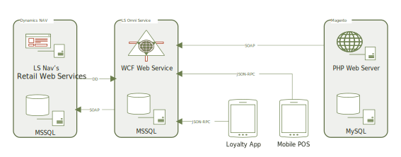

LS Mag for Magento 2

# Table of Contents

 1. Introduction
 2. Installation
 3. Usage
 4. Troubleshooting
 
# Introduction
The purpose of this document is to give an overview of LS Mag for Magento 2, the Magento extension part of the LS Retail’s Omni Solution.

The first chapter, *Introduction*, contains a high-level overview of the plugin and its functionalities.   
The second chapter, *Installation*, explains how to install the plugin and the initial configuration steps to get up & running.   
The third chapter, *Usage*, goes in detail over the features of the plugin and their configurations.
In the fourth chapter, *Troubleshooting*, we provide solutions and help for some common problems.

## LS Omni Solution overview
The LS Omni Solution consists of the LS Omni Service which uses the LS Omni DB and the LS Nav’s retail web services and the clients, the apps, loyalty portal and e-commerce platforms.  
LS Mag particularly consumes the SOAP eCommerceService interface; other clients consume other interfaces exposed by the LS Omni Service.

## About LS Mag

### LS Mag is a Magento 2 extension

LS Mag is a Magento extension that integrates with LS Retail NAV, allowing web retailers to leverage crucial operations to LS Nav, i.e. discount calculations, order life cycle management.   
The extension will populate the web store’s catalog with items coming from LS Nav and manage the life cycle of the orders created in Magento mirroring the status updates coming from LS Nav.  
LS Mag has been follows the best standards available for the Magento community.  
LS Mag is compatible with Magento CE 1.9.X and Magento EE 1.14.X and has been tested against Magento CE 1.7.X also.

### LS Mag is an LS Omni Service client

The LS Omni Service is a WCF web service running on an IIS web server.
LS Mag uses the LS Omni Service’s SOAP eCommerceService.
The LS Omni Service will call LS Nav’s web services on behalf of Magento. Also will serve content already stored in the LS Omni Database. 

### What LS Mag does

* Replication
  - LS Mag populates the Magento catalog (products and categories) using the replication endpoints on the LS Omni Service.
  - LS Mag keeps track of the last *preaction* fetching only delta updates.
  - Some of the data from LS Omni Service is stored in Magento using custom-made, non-native entities used by the plugin.

* Member Management
  - LS Nav’s members have immediate access to the Magento web store using the same LS Nav’s credentials.
  - LS Mag enables member registration through Magento.
  - Loyalty information will be shown in Magento on the account’s dashboard, i.e. points balance, club.

* Cart Integration
  - The Magento cart is mirrored in LS Omni as a OneList.
  - The cart totals are calculated directly on LS Nav and then updated in Magento.
  - LS Omni’s OneLists are shared with all LS Omni’s clients, i.e. the loyalty app. 

* Order Management
  - LS Mag will register an order and push it back to LS Nav.
  - LS Mag updates the Magento’s order state by polling changes directly from LS Nav.
  - LS Mag can create two types of web orders:
    - Sales Order: orders with payment & shipment information.
    - Special Order: orders using Click & Collect shipment method.

### Dependencies

* PHP 5.6 or 7.0 with the modules
  - soap 
* MySQL or MariaDB
* A running Magento 2 installation
* An LS Omni Server
* NAV 10.03 or newer
* Composer
* Git

# Installation
